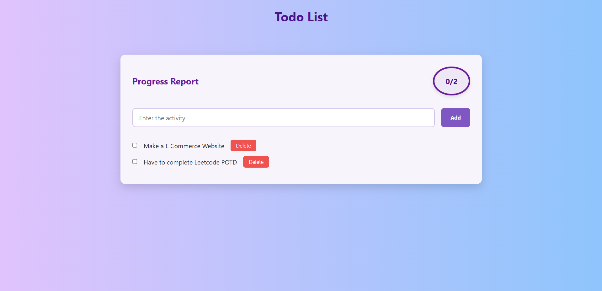
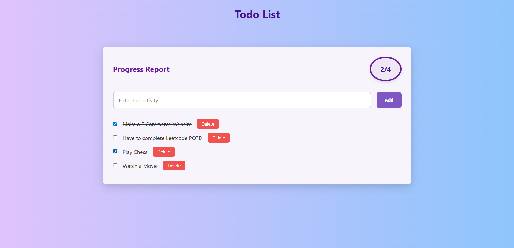

# 📝 Todo List Web App

A simple and elegant Todo List web application built using **HTML**, **CSS**, and **JavaScript** to help you manage daily tasks with ease.

---

## 🔧 Features

- ➕ Add new tasks
- ✅ Mark tasks as completed
- ❌ Delete tasks anytime
- 📊 Real-time progress report (completed/total tasks)

---

## 📸 Screenshots

---

## 💻 Tech Stack

- **HTML5** – For structuring content
- **CSS3** – For styling and layout
- **JavaScript (Vanilla)** – For DOM manipulation and logic

